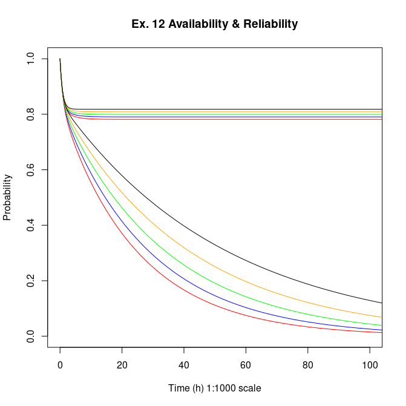

# Markov-Chain-Exercises

@TODO:
  - It lacks a dynamic way of generating the matrix
    - Seems to be very time consuming to implement. Thus, it may not be worth it
  - It still needs to be parameterized, in order to create N markov simulations

Example:
  - Varying coverage from 0.8 to 1 (step 0.05), corresponding to red, blue, green, orange and black, respectivelly;
  - The Asymptotic behavior is from Availability lines. The other lines are from Reliability.

